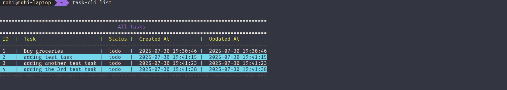

# Task Tracker CLI

A simple command-line task tracker I built. Just a practical tool that gets the job done from the terminal.

## What it does

- Add, update, and delete tasks
- Track task status (todo, in-progress, done)
- List tasks with filtering options
- Saves everything to a JSON file
- Colorful terminal output with formatted tables
- Interactive delete confirmation

## Installation

### Using pipx

```bash
sudo apt install pipx
```

```bash
git clone https://github.com/rougho/tasktracker-cli.git
cd tasktracker-cli
```

Inside the project directory, run:

```bash
pipx install -e .
```

Update the PATH:

```bash
pipx ensurepath
```


## Basic Usage

To add a task:
```bash
task-cli add "Buy groceries"
```


To list all tasks:
```bash
task-cli list
```


to mark something as done:
```bash
task-cli mark-done 1
```


To update a task:
```bash
task-cli update 1 "Buy organic groceries" -s in-progress
```


## Commands

Here's what you can do:

### Adding stuff
```bash
task-cli add "Do something important"
task-cli add "Another task" --status in-progress
```

### Checking your tasks

#### Listing all tasks
```bash
task-cli list
```
#### Listing tasks by their status
```bash
task-cli list todo
task-cli list done
task-cli list in-progress
```

### Updating tasks
```bash
task-cli update 1 "Better task description"
task-cli update 2 "Finished task" --status done
```

### Status changes
```bash
task-cli mark-done 1
task-cli mark-in-progress 2 
task-cli mark-todo 3
```

### Deleting tasks
```bash
task-cli delete 1
```

## How it works

Tasks get saved to `data/task_data.json` in whatever directory you're in. Each task has:
- A unique UUID
- A sequential index number for easy reference
- Description
- Status (todo/in-progress/done)
- Creation timestamp
- Last updated timestamp

Here's what a task looks like in the JSON:
```json
{
  "description": "test number one",
  "status": "todo", 
  "id": "a2529839-d88e-4724-8e57-033dfd1eaa78",
  "index": 1,
  "createdAt": "2025-07-30 14:41:54",
  "updatedAt": "2025-07-30 14:41:54"
}
```

## Command Cheat Sheet

| Command | What it does | Example |
|---------|--------------|---------|
| `add` | Add new task | `task-cli add "New thing to do"` |
| `list` | Show tasks | `task-cli list done` |
| `update` | Change task | `task-cli update 1 "Updated description"` |
| `delete` | Remove task | `task-cli delete 1` |
| `mark-done` | Mark complete | `task-cli mark-done 1` |
| `mark-in-progress` | Mark active | `task-cli mark-in-progress 1` |
| `mark-todo` | Mark pending | `task-cli mark-todo 1` |

Get help with `task-cli --help` or `task-cli <command> --help`.

## What makes it nice

- **No dependencies**: Just uses Python's standard library
- **Colors**: Uses ANSI colors for pretty output (defined in `colors.py`)
- **Tables**: Tasks display in formatted tables with alternating row colors
- **Safe deletes**: Shows you exactly what you're deleting before you confirm
- **Flexible status**: You can set status when adding or change it later


## Development

If you want to hack on this:

```bash
git clone https://github.com/rougho/tasktracker-cli.git
cd tasktracker-cli
pipx install -e .

# Run tests using unittest
python -m unittest discover tests/ -v
```

The code structure:
```
src/tasktracker/
├── colors.py          # Terminal colors (ANSI codes)
├── tasks.py           # Core Task class and Manager
├── task_tracker.py    # CLI interface with argparse
└── pretty_print.py    # Table formatting and success messages

tests/
└── test_tasktracker.py  # Comprehensive tests with unittest

data/
└── task_data.json     # Where your tasks live
```

### Key components:
- **Task class**: Dataclass with all the task properties
- **Manager class**: Handles CRUD operations and JSON persistence  
- **CLI**: Uses argparse for command handling
- **Pretty printing**: Colorful tables and success messages
- **Tests**: Full test coverage with unittest

### Running tests:

#### Run all tests with verbose output

```bash
python -m unittest discover tests/ -v
```

#### Run specific test file
```bash
python -m unittest tests.test_tasktracker
```

#### Run specific test class
```bash
python -m unittest tests.test_tasktracker.TestAddTask -v
```

## Contributing

Found a bug? Want to add something? Cool! Open an issue or send a PR.

## License

MIT - do whatever you want with it.

---

Built with Python. Tested on Linux. Should work anywhere Python works.